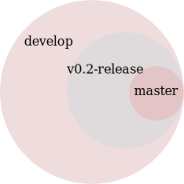

Release Instructions
********************************************************
The purpose of this document is to act as a guideline and checklist for how 
to release the pyne code base.

Release Candidates & Branches
=============================
All releases should have a release candidate ('-rc1') that comes out 2 - 5 days
prior to the scheduled release.  During this time, no changes should occur to 
a special release branch ('vX.X.X-release').  

The release branch is there so that development can continue on the 
develop branch while the release candidates (rc) are out and under review.  
This is because otherwise any new developments would have to wait until 
post-release to be merged into develop to prevent them from accidentally 
getting released early.    

As such, the 'vX.X.X-release' branch should only exist while there are 
release candidates out.  They are akin to a temporary second level of staging 
to be used to keep master clean and safe.  As such, everything that is in this 
branch should also be part of develop.  Graphically, 

    **Figure 1:** Branch hierarchy under release.

Every time a new release candidate comes out the vX.X.X-release should be 
tagged with the name 'X.X.X-rcX'.  There should be a 2 - 5 day period of time 
in between release candidates.  When the full and final release happens, the 
'vX.X.X-release' branch is merged into master and then deleted.

If you have a new fix that needs to be in the next release candidate, you should 
make a topical branch and then pull request it into the release branch.  After this 
has been accepted, the topical branch should be merged with develop as well.

The release branch must be quiet and untouched for 2 - 5 days prior to the full 
release.

Checklist
=========
When releasing pyne, make sure to do the following items in order:

1. Review **ALL** issues in the issue tracker, reassigning or closing them as needed.
2. Ensure that all issues in this release's milestone have been closed.  Moving issues
   to the next release's milestone is a perfectly valid strategy for completing this
   milestone. 
3. Perform maintainence tasks for this project, see below.
4. Write and commit the release notes.
5. Review the current state of documentation and make approriate updates.
6. Bump the version (in code, documentation, etc.) and commit the change.
7. If this is a release candidate, tag the release branch with a name that matches 
   that of the release: 

   * If this is the first release candidate, create a release branch called
     'vX.X.X-release' off of develop.  Tag this branch with the name 'X.X.X-rc1'.
   * If this is the second or later release candidate, tag the release branch 
     with the name 'X.X.X-rcX'.

8. If this is the full and final release (and not a release candidate), 
   merge the release branch into the master branch.  Next, tag the master branch 
   with the name 'X.X.X'.  Finally, delete the release branch.
9. Push the tags upstream
10. Update release information on the website.

Maintainence Tasks
==================
PyNE may have associated maintenance tasks which may need to be performed at 
least as often as every minor release.  These are as follows (all commands are run 
from the root dir):

**Recreate prebuilt nuclear data:**

.. code-block:: bash

    $ nuc_data_make --fetch-prebuilt False --make-open-only True -o prebuilt_nuc_data.h5

**Set symbolic enrichment to 40 species:**

.. code-block:: bash

    $ echo '#include "enrichment_symbolic40.cpp"' > cpp/enrichment_symbolic.cpp