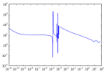
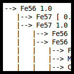
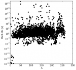
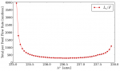
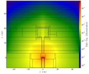
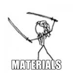
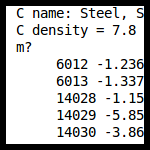
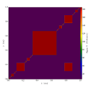
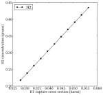
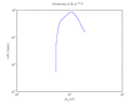

.. _gallery:

============
Gallery
============
Browse and borrow code from the PyNE gallery!

.. toctree::
    :glob:
    :hidden:

    *

|ace| |chainsolve_transmutation| |discretized_teapot| |half_life| |data_source| 
|enrichment_mstar_vs_flowrate| |fng_model| |materials| |material_library| |mesh_tags| 
|open_origen_data| |origen22_h1_xs| |reaction_names| |endf_reader|

.. |discretized_teapot| image:: discretized_teapot_thumb.png
    :target: discretized_teapot.html

.. |data_source| image:: data_sources_thumb.png
    :target: data_sources.html

.. |open_origen_data| image:: open_origen_data_thumb.png
    :target: open_origen_data.html

