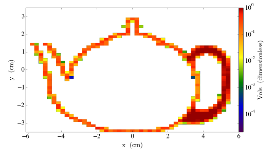
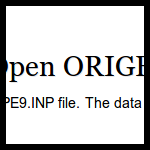

.. _gallery:

============
Gallery
============
Browse and borrow code from the PyNE gallery!

.. toctree::
    :glob:
    :hidden:

    *

|ace| |chainsolve_transmutation| |discretized_teapot| |half_life| |data_source| 
|enrichment_mstar_vs_flowrate| |fng_model| |materials| |material_library| |mesh_tags| 
|open_origen_data| |origen22_h1_xs| |reaction_names| |endf_reader|

.. |ace| image:: ace_thumb.png
    :target: ace.html

.. |half_life| image:: half_life_thumb.png
    :target: half_life.html

.. |data_source| image:: data_sources_thumb.png
    :target: data_sources.html

.. |enrichment_mstar_vs_flowrate| image:: enrichment_mstar_vs_flowrate_thumb.png
    :target: enrichment_mstar_vs_flowrate.html

.. |fng_model| image:: fng_model_thumb.png
    :target: fng_model.html

.. |origen22_h1_xs| image:: origen22_h1_xs_thumb.png
    :target: origen22_h1_xs.html

.. |reaction_names| image:: reaction_names_thumb.png
    :target: reaction_names.html

.. |endf_reader| image:: endf_reader_thumb.png
    :target: endf_reader.html

