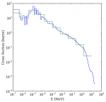
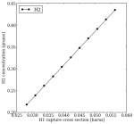

.. _gallery:

============
Gallery
============
Browse and borrow code from the PyNE gallery!

.. toctree::
    :glob:
    :hidden:

    *

|half_life| |data_source| |enrichment_mstar_vs_flowrate| |materials| |origen22_h1_xs|
|reaction_names|

.. |half_life| image:: half_life_thumb.png
    :target: half_life.html

.. |enrichment_mstar_vs_flowrate| image:: enrichment_mstar_vs_flowrate_thumb.png
    :target: enrichment_mstar_vs_flowrate.html

.. |materials| image:: materials_thumb.png
    :target: materials.html

