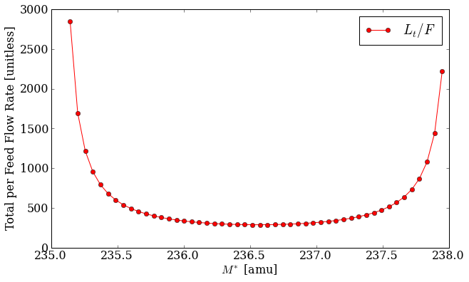

.. currentmodule:: pyne.enrichment

.. _usersguide_enrichment:

======================
Enrichment
======================
Nuclide - and specifically uranium - enrichment is a common materials task. 
This is the process by which the isotopic distribution is modified based on 
the masses of the constituent nuclides.  On an industrial scale, this is ofen 
done using gaseous diffusion or gas centrifuge cascades.

The PyNE enrichment module provides a technology-independent way of solving 
for the product and tails material streams given an initial feed material 
and the following parameters:

* :math:`j` (``j``) - enriched key component: nuclide to enrich in product
  stream ['U-235'].
* :math:`k` (``k``) - de-enriched key component: nuclide to enrich in tails
  stream ['U-238'].
* :math:`\alpha` (``alpha``) - stage separation factor: the proportion that 
  each stage enriches [1.05].
* :math:`x^F_j` (``x_feed_j``) - target enrichment of jth key component in feed 
  material [0.0072].
* :math:`x^P_j` (``x_prod_j``) - target enrichment of jth key component in product
  material [0.05].
* :math:`x^T_j` (``x_tail_j``) - target enrichment of jth key component in tails
  material [0.0025].
* ``mat_feed`` - feed material stream: material to be enriched, this
  should only contains isotopes of a single element [natural uranium].

The following cascade attributes must also be given as sane initial guesses:

* :math:`M^*` (``Mstar``) - mass separation factor: initial guess for overall 
  mass separation for the cascade [236.5].
* :math:`N` (``N``) - number of enriching stages: initial geuss [30.0].
* :math:`M` (``M``) - number of stripping stages: initial geuss [10.0].

For two component mixtures, i.e. those with only two nuclides in the feed material,
enrichment is well defined and the optimal cascade setup may be solved for trivially.  
However, for more than two components, the cascade cannot be determined from the 
target enrichments alone (``x_feed_j``, ``x_prod_j``, ``x_tail_j``).  Because the 
mass balance equations themselves are under-determined extra constraints must be
emplaced.  This turns out to be a minimization of the total material flow rate 
through the cascade per unit of feed [WOOD]_ [GARZA]_.  This value, :math:`L_t/F`, 
may be seen as a function of the mass separtation :math:`M^*` below.

    **Figure 1:** *The normalized total flow rate as a function of the mass separation 
    factor between the jth and kth key components for a sample uranium cascade.*

--------------
Example of Use
--------------
This example irradiates 1 kg of water for 1000 days in ORIGEN 2.2, increasing the 
capture cross section of Hydrogen-1 by 10% each time.  The Hydrogen-2 concentration 
is then gathered and displayed. This example may be found in the source tree as 
:file:`examples/origen22_h1_xs.py`. Note that in this example, the ``'BASE_TAPE9.INP'``
file must be supplied by the user.  Additionally, the execution path for ORIGEN
(here ``o2_therm_linux.exe``) may differ by system and platform::

    from subprocess import check_call

    from pyne import origen22
    from pyne.api import Material

    # 1 kg of water
    water = Material()
    water.from_atom_frac({'H1': 2.0, 'O16': 1.0})
    water.mass = 1E3

    # Make a tape4 file for water
    origen22.write_tape4(water)

    # Make a tape 5 for this calculation
    #   * Just output the concentration tables
    #   * The cross-section library numbers must 
    #     the library / deck numbers in tape9 
    origen22.write_tape5_irradiation("IRF", 1000.0, 4E14,
                                     xsfpy_nlb=(381, 382, 383),
                                     out_table_num=[5])

    # Grab a base tape9 from which we will overlay new values
    # This must be supplied by the user
    base_tape9 = origen22.parse_tape9("BASE_TAPE9.INP")

    base_h1_xs = base_tape9[381]['sigma_gamma'][10010]

    # Init a dumb overlay tape9
    overlay_tape9 = {381: {'_type': 'xsfpy',
                           '_subtype': 'activation_products',
                           'sigma_gamma': {10010: base_h1_xs},
                           }
                    }

    # Run origen, increasing the cross section each time.
    h2_concentration = []
    for i in range(11):
        overlay_tape9[381]['sigma_gamma'][10010] = (1.0 + i*0.1) * base_h1_xs

        # Merge the base and overlay, and write out
        new_tape9 = origen22.merge_tape9([overlay_tape9, base_tape9])
        origen22.write_tape9(new_tape9, 'TAPE9.INP')

        # Run and parse origen output
        rtn = check_call(['o2_therm_linux.exe'])
        tape6 = origen22.parse_tape6('TAPE6.OUT')
        h2_concentration.append(tape6['table_5']['summary']['activation_products']['H2'][-1])

    print
    print "H2 Concentration: ", h2_concentration

Further information on the enrichment module may be seen in the library reference 
:ref:`pyne_enrichment`.

.. [WOOD] H. G. Wood, V. D. Borisevich, G. A. Sulaberidze, '*On a Criterion Efficiency for 
          Multi-Isotope Mixtures Separation*,' Separation Science and Technology, 34:3, 
          343 - 357, DOI: 10.1081/SS-100100654, URL: http://dx.doi.org/10.1081/SS-100100654.
.. [GARZA] de la Garza, A., '*RESOLUTION OF A MULTICOMPONENT CASCADE WITH TWO KEY WEIGHTS AND 
           MULTI-FEEDS AND WITHDRAWALS.*,' Atomic Energy Commission Combined Operations Planning,
           Oak Ridge, Tenn., Report Number AECOP--330, 1969 Dec 01, DOI 10.2172/4106611, 
           URL: http://dx.doi.org/10.2172/4106611.

