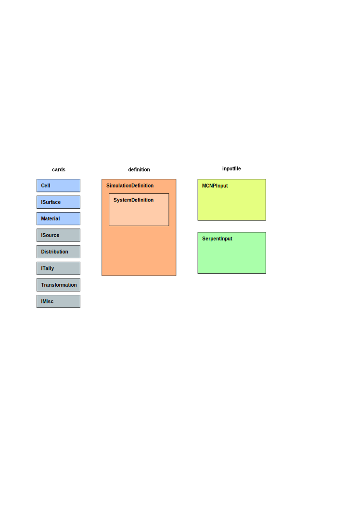

.. _usersguide_simplesim:

=======================
Simple Simulation Input
=======================

.. currentmodule:: pyne.simplesim

This package aids the creation, and modification, of input files for common
nuclear science and engineering codes. Currently, only MCNP (Monte Carlo
N-Particle Transport) is supported.

This page presents an overview of the :py:mod:`simplesim` package, including a
discussion of why it was made, how it is used, and some examples. This guide is
not intended by any means to be a replacmenet for a specific code's own
documentation.

It is expected that when using this package, the user has the library
reference, at :ref:`pyne_simplesim`, open. The reference contains descriptions
and examples of every card that is implemented.

If you are interested in developing this package
further or are looking for information about the state of development, visit
:ref:`devsguide_simplesim` and/or contact the developers.

*******
Purpose
*******
Some may feel that it is fairly easy and straight-forward to create input files
for the popular codes in nuclear science and engineering. However, the
following functionality may be desirable:

1. Card numbers are managed automatically using card names, like how labels and
   references work in LaTeX.
2. An object-oriented interface that allows changes to the input to be made
   only in one place.
3. An abstract way to define a system and the simulation of the system that does not 
   depend on a specific code's syntax. It is truly valuable to be able to
   define a reactor in a way that can be used to generate input for two or more
   different codes. However, the definition is not necessarily generalizable
   across different codes.
4. The input is persisent and amenable to modification (e.g. for parameter
   space studies).

This package aims to achieve these four objectives. Currently, only MCNP is
supported.

*****
Usage
*****

The structure of the package, showing key methods, is illustrated in the
following diagram (the :py:mod:`pyne.simplesim.nestedgeom` module is omitted).
The basic unit of input for a simulation is a card, and there is a slew of
cards in the :py:mod:`pyne.simplesim.cards` module. The cards are added to
defintions, and the definition is handed over to an input file object which
actually creates the input file.

.. The image above was made using Inkscape, and is completey editable as an
   Inkscape SVG file.

An input file is generated by the following procedure:

1. System-related cards are created directly.

   a. Material cards.
   b. Surface cards.
   c. Regions are formed from the surfaces using :py:attr:`cards.ISurface.neg`,
      :py:attr:`cards.ISurface.pos`, and the overloaded operators ``&`` (the
      magic method ``__and__``) and ``|`` (the magic method ``__or__``).
   d. The regions (surface combinations) and materials are combined into cells.

2. The cell cards are added to a :py:class:`definition.SystemDefinition` using
   :py:meth:`definition.SystemDefinition.add_cell`. This automatically adds the
   necessary materials and surfaces to the system.

   a. If the user wants to provide materials or surfaces in the system that
      are not used in cells, they can do so manually using
      :py:meth:`definition.SystemDefinition.add_material` and
      :py:meth:`definition.SystemDefinition.add_surface`.

3. Simulation cards are created directly. If looking for a card for which you
   only know its name in a specific code (i.e. MCNP), just search for that name
   in the library reference; the reference contains the name of the cards in
   the specific codes.

   a. Particle sources (and related source distributions).
   b. Tallies/detectors.
   c. Other cards.

4. Add the simulation cards to a :py:class:`definition.SimulationDefinition`,
   passing to this the system definition.  If writing an MCNP input,
   :py:class:`definition.MCNPSimulation` should be used.
5. Create an object of a :py:class:`inputfile.IInputFile`, passing a simulation
   definition.
6. Call the :py:meth:`inputfile.IInputFile.write` method.
7. Modify the input (i.e. for parameter studies) by simply modifying the
   attributes of the cards.

Here are some things to keep in mind:

Card names must be unique within their category
    Each card has a name. Usually, the user provides the name (see below about
    unique cards). Within a category (material, surface, cell, source,
    distribution, tally, misc, transformation, etc.), the card name must be
    unique. Card names are used to reference the card in other cards. The name
    functions like labels do in LaTeX: instead of having the user provide
    numbers to identify cards, the code manages the card numbers using
    user-provided card names.

Unique cards
    Some cards are unique, meaning there can only be one of them in the
    simulation. Logically, then, the user cannot define a name for these cards,
    and the names are set by the card definition.

User custom cards
    The packages does not attempt to cover the entire functionality of the
    code(s) it supports. Therefore, there is provision for the user to create
    their own custom cards. This can be done in two ways: (1) using custom
    cards, or (2) using :py:meth:`inputfile.IInputFile.add_user_card` and
    :py:meth:`inputfile.IInputFile.add_user_literal`.

*********
Modifying
*********

In general, a definition, or the cards that make up the definition, can be
modified at any point, and a new input file can be generated with these
changes. This makes it easy to do parameter space studies and the like. See the
examples to see how this is done.

Furthermore, if the functionality of a card is silly, the user can override it
themselves. Say the user does not like how the method
:py:meth:`cards.ICellSurfTally.mcnp` works: a method can be overloaded by
subclassing the card and overloading the method.

********
Examples
********

These pages contain examples of how the package is expected to be used. The
examples all come from  `pyne/examples/simplesim.py`.

.. toctree::
    :maxdepth: 1

    simplesim_ex_inflattice
    simplesim_ex_godiva
    simplesim_ex_raddetect
    simplesim_ex_custom

.. TODO MCNPXDigitalWorkshop modules

