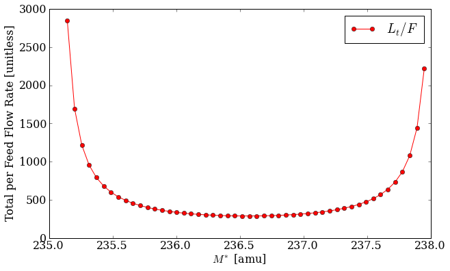

.. currentmodule:: pyne.enrichment

.. _usersguide_enrichment:

======================
Enrichment
======================
Nuclide - and specifically uranium - enrichment is a common materials task. 
This is the process by which the isotopic distribution is modified based on 
the masses of the constituent nuclides.  On an industrial scale, this is often 
done using gaseous diffusion or gas centrifuge cascades.

The PyNE enrichment module provides a technology-independent way of solving 
for the product and tails material streams given an initial feed material 
and the following parameters:

* :math:`j` (``j``) - enriched key component: nuclide to enrich in product
  stream ['U-235'].
* :math:`k` (``k``) - de-enriched key component: nuclide to enrich in tails
  stream ['U-238'].
* :math:`\alpha` (``alpha``) - stage separation factor: the proportion that 
  each stage enriches [1.05].
* :math:`x^F_j` (``x_feed_j``) - target enrichment of jth key component in feed 
  material [0.0072].
* :math:`x^P_j` (``x_prod_j``) - target enrichment of jth key component in product
  material [0.05].
* :math:`x^T_j` (``x_tail_j``) - target enrichment of jth key component in tails
  material [0.0025].
* ``mat_feed`` - feed material stream: material to be enriched, this
  should only contains isotopes of a single element [natural uranium].

The following cascade attributes must also be given as sane initial guesses:

* :math:`M^*` (``Mstar``) - mass separation factor: initial guess for overall 
  mass separation for the cascade [236.5].
* :math:`N` (``N``) - number of enriching stages: initial guess [30.0].
* :math:`M` (``M``) - number of stripping stages: initial guess [10.0].

For two component mixtures, i.e. those with only two nuclides in the feed material,
the mass balance and flow rate equations are well defined and the optimal enrichment
cascade setup may be solved for trivially.  
However, for more than two components, the cascade cannot be determined from the 
target enrichments alone (``x_feed_j``, ``x_prod_j``, ``x_tail_j``).  Because the 
mass balance equations themselves are under-determined extra constraints must be
emplaced.  This turns out to be a minimization of the total material flow rate 
through the cascade per unit of feed [WOOD]_ [GARZA]_.  This value, :math:`L_t/F`, 
may be seen as a function of the mass separation :math:`M^*` below.

    **Figure 1:** *The normalized total flow rate as a function of the mass separation 
    factor between the jth and kth key components for a sample uranium cascade.*
    :download:`[ipython notebook] <mstar_vs_flowrate.ipynb>`

It is easy to see how the flow rate is minimized near the center of this bucket-shape in 
Figure 1.  Finding this minimum point is what the :func:`multicomponent`
function does.  This optimization is the main function of the enrichment module.

--------------
Example of Use
--------------
The fundamental data structure of enrichment is the :class:`Cascade`.
Cascades are containers for attributes which define a technology-agnostic cascade.
You may set up a cascade either by passing keyword arguments into the constructor
or as attributes on the instance:

.. code-block:: python

    import pyne.enrichment as enr
    from pyne.material import Material

    casc = enr.Cascade(x_prod_j=0.06)
    feed = Material({
            922320: 1.1 * (10.0**-9),
            922340: 0.00021,
            922350: 0.0092,
            922360: 0.0042,
            922380: 0.9863899989,
            })
    casc.mat_feed = feed

A default uranium enrichment cascade is provided as a quick way to set up a basic
Cascade instance, which you may modify later:

.. code-block:: python

    orig_casc = enr.default_uranium_cascade()
    orig_casc.x_prod_j = 0.06
    orig_casc.mat_feed = feed

This may then be fed into the :func:`multicomponent` function to produce an optimized
version of the original cascade.  The product and tails material streams have been
computed on the optimized version:

.. code-block:: python

    >>> opt_casc = enr.multicomponent(orig_casc, tolerance=1E-11)
    >>> print opt_casc.mat_prod
    Material: 
    mass = 0.11652173913
    atoms per molecule = -1.0
    -------------------------
    U232   9.25100048726e-09
    U234   0.00160553384204
    U235   0.0600000000115
    U236   0.0193252508798
    U238   0.919069206016

Further information on the enrichment module may be seen in the library reference 
:ref:`pyne_enrichment`.

.. [WOOD] H. G. Wood, V. D. Borisevich, G. A. Sulaberidze, '*On a Criterion Efficiency for 
          Multi-Isotope Mixtures Separation*,' Separation Science and Technology, 34:3, 
          343 - 357, DOI: 10.1081/SS-100100654, URL: http://dx.doi.org/10.1081/SS-100100654.
.. [GARZA] de la Garza, A., '*RESOLUTION OF A MULTICOMPONENT CASCADE WITH TWO KEY WEIGHTS AND 
           MULTI-FEEDS AND WITHDRAWALS.*,' Atomic Energy Commission Combined Operations Planning,
           Oak Ridge, Tenn., Report Number AECOP--330, 1969 Dec 01, DOI 10.2172/4106611, 
           URL: http://dx.doi.org/10.2172/4106611.

